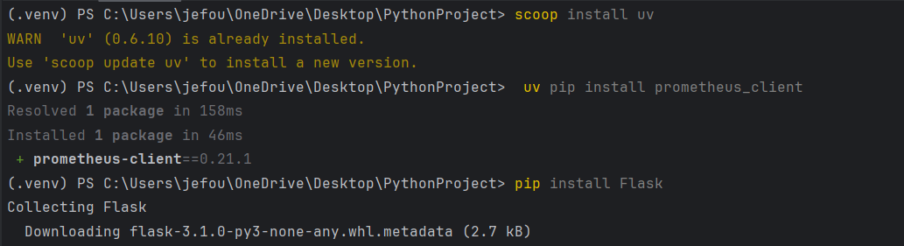
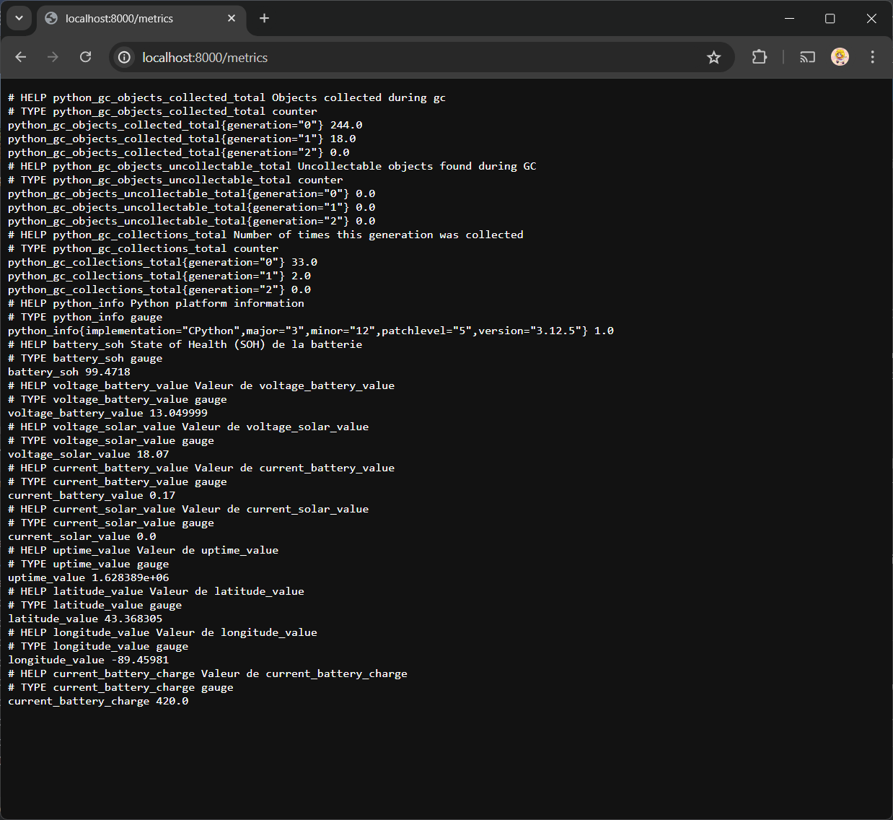
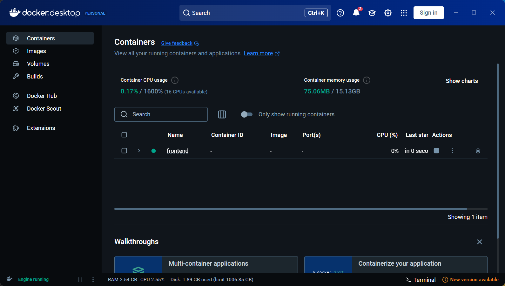
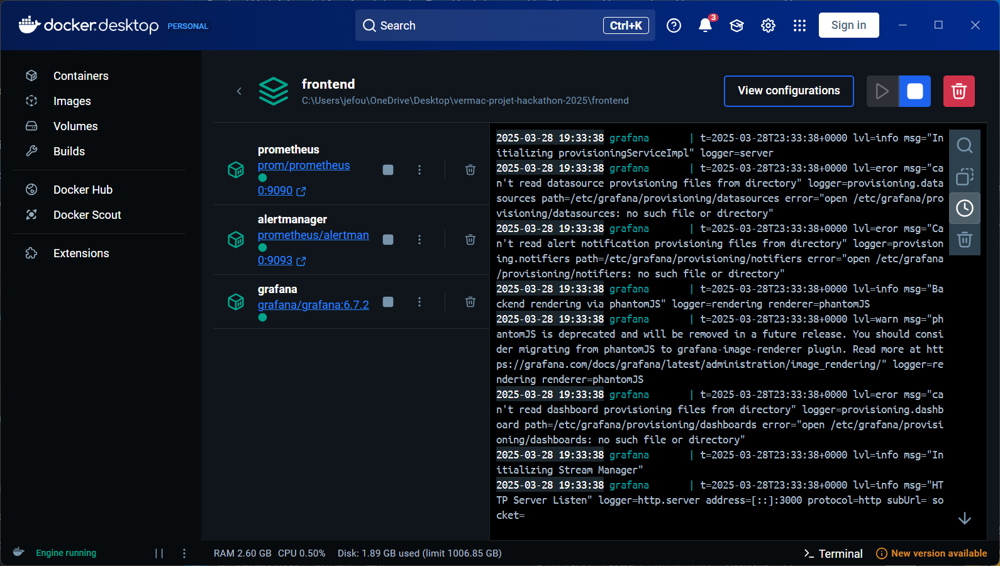
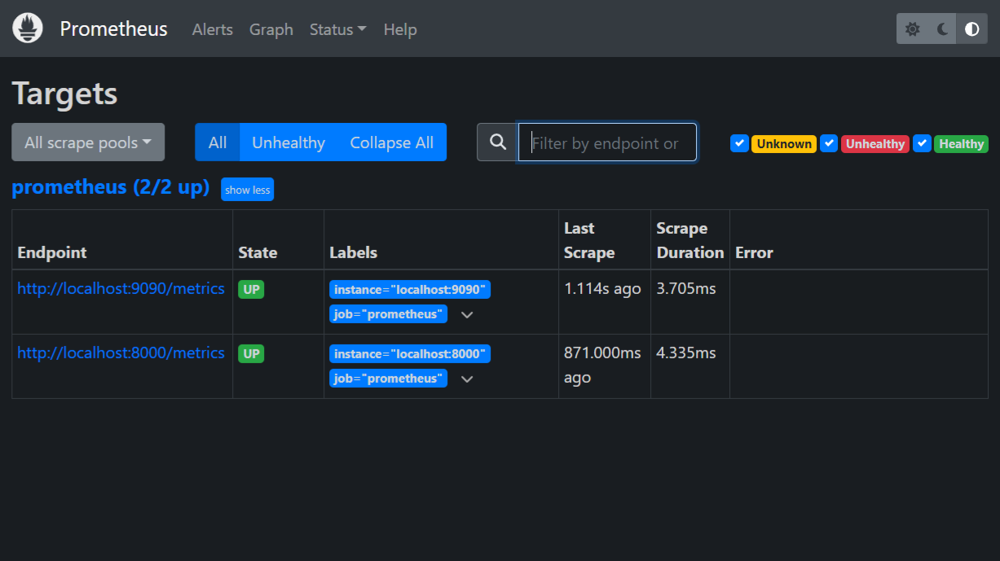
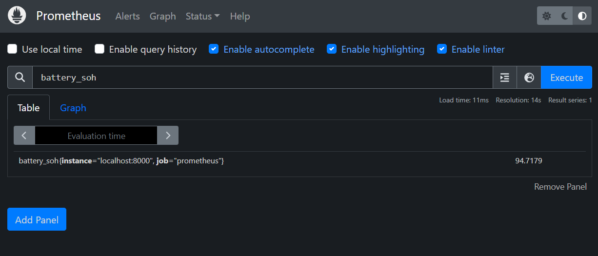
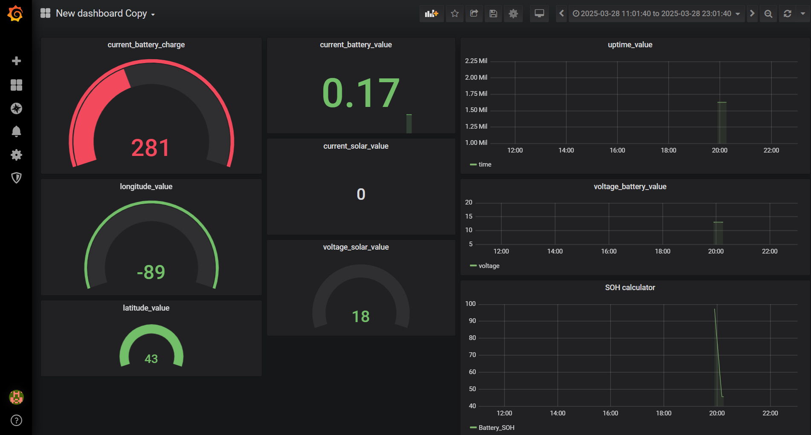
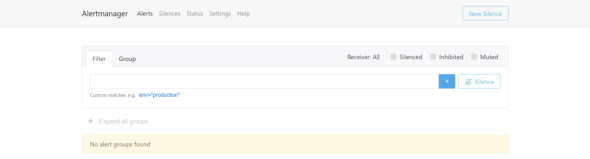

# Project Ver MAC - Hackathon 2025

<h1 align="center">
  <a href="https://github.com/TheBeesness/project_ver_mac">
    
  </a>
</h1>

<div align="center">
   🐝📸⚜️ <b>Hackathon 2025 - Project Ver MAC</b> 🐝📸⚜️
  <br />
  <a href="#about"><strong>Explore the screenshots »</strong></a>
  <br />
  <br />
  <a href="https://github.com/TheBeesness/project_ver_mac/issues/new?assignees=&labels=bug&template=01_BUG_REPORT.md&title=bug%3A+">Report a Bug</a>
  ·
  <a href="https://github.com/TheBeesness/project_ver_mac/issues/new?assignees=&labels=enhancement&template=02_FEATURE_REQUEST.md&title=feat%3A+">Request a Feature</a>
  ·
  <a href="https://github.com/TheBeesness/project_ver_mac/issues/new?assignees=&labels=question&template=04_SUPPORT_QUESTION.md&title=support%3A+">Ask a Question</a>
</div>

---

## Table of Contents

- [About](#about)
  - [Built With](#built-with)
- [Getting Started](#getting-started)
  - [Prerequisites](#prerequisites)
  - [Installation](#installation)
- [Usage](#usage)
- [Monitoring Tools Overview](#monitoring-tools-overview)
- [Roadmap](#roadmap)
- [Support](#support)
- [Contributing](#contributing)
- [Authors & Contributors](#authors--contributors)
- [Security](#security)
- [Acknowledgements](#acknowledgements)

## About

Project **Ver MAC** was developed as part of Hackathon 2025 in Quebec City ⚜️, organized by **Québec International's Mon Avenir TI initiative**. The challenge was to design a program that could estimate a battery's lifespan based on collected data.

<details>
<summary>Screenshots</summary>
<br>
🛠️ Installation Process  


🎨 Frontend Running  


📊 Metrics Displayed on Web Interface  


🐳 Docker Containers Overview  


⚙️ Docker Configuration View  


🎯 Prometheus Targets  


🔍 Querying Metrics in Prometheus  


📊 Grafana Dashboard  


🚨 AlertManager Interface  

</details>

### Built With

- **Python 3.12**
- **UV**
- **Pip**
- **Prometheus_client**
- **Docker**
- **Grafana**

## Getting Started

### Prerequisites

To work with this project, you need to have:

- **UV installed** (inside your virtual environment `.venv`)
- **Prometheus_client installed** (for metric collection)
- **Docker installed** (for containerized deployment)

### Installation

#### Backend Setup

1. Open your **terminal**.
2. Install `uv` (inside your virtual environment):
   ```sh
   scoop install uv
   ```
3. Install Flask:
   ```sh
   pip install Flask
   ```
4. Install Prometheus client library:
   ```sh
   uv pip install prometheus_client
   ```
5. Run the program:
   ```sh
   python main.py
   ```
6. Web server access:
   ```sh
   http://localhost:8000/metrics
   ```

#### Frontend Setup

1. Navigate to:
   ```sh
   cd vermac-projet-hackathon-2025/prepa/promfun/prometheus
   ```
2. Start Docker containers:
   ```sh
   docker compose up -d
   ```
3. Web access:
   - **Prometheus**: [http://localhost:9090/](http://localhost:9090/)
   - **Grafana**: [http://localhost:3000/](http://localhost:3000/)
   - **AlertManager**: [http://localhost:9093/](http://localhost:9093/)

## Usage

### Backend

1. In `main.py`, set the path to the `.json` file containing the battery data.
2. Run:
   ```sh
   python main.py
   ```
3. The program will process the latest data entry and compute the **State of Health (SOH)** metric.
4. The SOH value is stored and exposed via the web server on port **8000**.
5. Check the processed metrics:
   ```sh
   http://localhost:8000/metrics
   ```

### Frontend

1. Install **Docker Desktop**: [Docker Website](https://www.docker.com/)
2. Navigate to the frontend directory:
   ```sh
   cd frontend
   ```
3. Start the containers:
   ```sh
   docker compose up -d
   ```
4. Access monitoring tools:
   - **Prometheus**: [http://localhost:9090/](http://localhost:9090/)
   - **Grafana**: [http://localhost:3000/](http://localhost:3000/)
   - **AlertManager**: [http://localhost:9093/](http://localhost:9093/)

## Monitoring Tools Overview

### Prometheus
Prometheus is a powerful open-source monitoring and alerting toolkit designed for reliability and scalability. It collects metrics from configured targets at given intervals, evaluates rule expressions, displays results, and triggers alerts if certain conditions are met.

### Grafana
Grafana is an open-source platform for monitoring and observability. It provides interactive visualizations, customizable dashboards, and integrations with multiple data sources, including Prometheus, to facilitate real-time data analysis.

### AlertManager
AlertManager handles alerts sent by Prometheus. It manages alert deduplication, grouping, silencing, and sending notifications via email, Slack, or other channels. It ensures efficient incident management and response in a production environment.

## Roadmap

See the [open issues](https://github.com/TheBeesness/project_ver_mac/issues) for upcoming features and known issues.

- [Feature Requests](https://github.com/TheBeesness/project_ver_mac/issues?q=label%3Aenhancement+is%3Aopen+sort%3Areactions-%2B1-desc)
- [Top Bugs](https://github.com/TheBeesness/project_ver_mac/issues?q=is%3Aissue+is%3Aopen+label%3Abug+sort%3Areactions-%2B1-desc)
- [Newest Bugs](https://github.com/TheBeesness/project_ver_mac/issues?q=is%3Aopen+is%3Aissue+label%3Abug)

## Support

If you need additional support, feel free to reach out.

## Contributing

Please read [our contribution guidelines](docs/CONTRIBUTING.md) before submitting pull requests or issues.

## Authors & Contributors

Project Ver MAC was developed by the **Beesness Core Team**.

See the full list of contributors on [GitHub](https://github.com/TheBeesness/project_ver_mac/contributors).

## Security

Project Ver MAC follows good security practices, but absolute security cannot be guaranteed. Use at your own risk.

For security concerns, refer to our [security documentation](docs/SECURITY.md).

## Acknowledgements

Special thanks to **Québec International** for organizing Hackathon 2025 and providing this opportunity to innovate.

