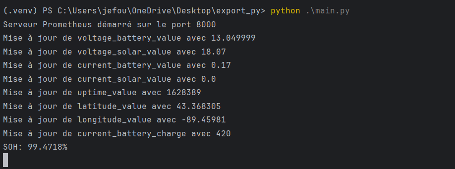

<!-- PROJECT LOGO -->
 

  

  <h3 align="center">Hackathon 2025 🦆</h3>

  

    Project Ver-MAC
     
    <a href="#about"><strong>Explore the screenshots »</strong></a>
       
       
      <a href="https://github.com/TheBeesness/project_ver_mac/issues/new?assignees=&labels=bug&template=01_BUG_REPORT.md&title=bug%3A+">Report a Bug</a>
      ·
      <a href="https://github.com/TheBeesness/project_ver_mac/issues/new?assignees=&labels=enhancement&template=02_FEATURE_REQUEST.md&title=feat%3A+">Request a Feature</a>
      ·
      <a href="https://github.com/TheBeesness/project_ver_mac/issues/new?assignees=&labels=question&template=04_SUPPORT_QUESTION.md&title=support%3A+">Ask a Question</a>
  

  ## Table of Contents
  <ol>
    <li>
      <a href="#about">About</a>
      <ul>
        <li><a href="#built-with">Built With</a></li>
      </ul>
    </li>
    <li>
      <a href="#getting-started">Getting Started</a>
      <ul>
        <li><a href="#prerequisites">Prerequisites</a></li>
        <li><a href="#installation">Installation</a></li>
      </ul>
    </li>
    <li><a href="#usage">Usage</a></li>
    <li><a href="#monitoring-tools-overview">Monitoring Tools Overview</a></li>
    <li><a href="#authors--contributors">Authors & Contributors</a></li>
    <li><a href="#acknowledgments">Acknowledgments</a></li>
  </ol>

<!-- ABOUT THE PROJECT -->
## About
**project_name** is a ... description

 

    
 

 
🛠️ Installation Process  

🎨 Frontend Running  

### Built With

- **Python 3.12**
- **UV**
- **Pip**
- **Prometheus_client**
- **Docker**
- **Grafana**

## Getting Started

### Prerequisites

To work with this project, you need to have:
- exemple
- exemple

### Installation

1. Open your **terminal**.
2. Install ..
3. Install ..
4. Install ..
5. Run the program ..

## Usage

1. In `main`...
2. Run ...
3. etc ..

## Monitoring Tools Overview

...

## Authors & Contributors

...

## Acknowledgments

Remerciment:

* exemple
* exemple

(<a href="#readme-top">back to top</a>)

